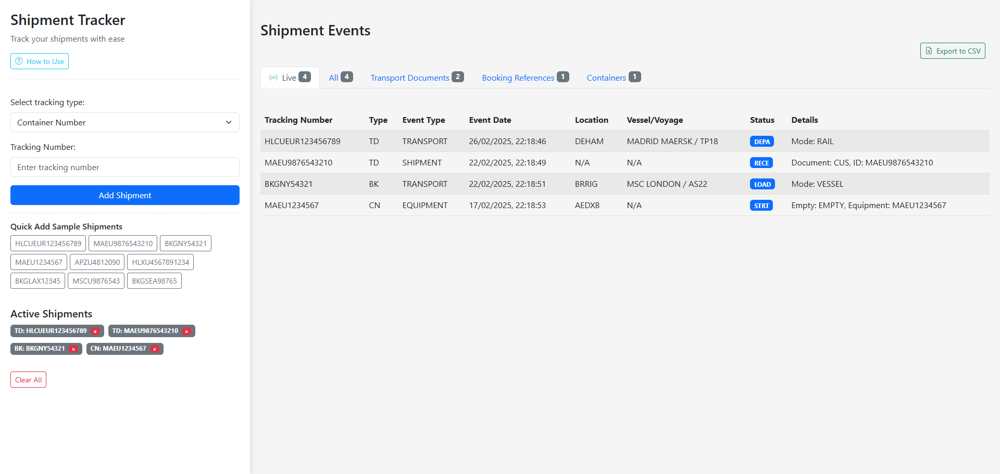

# Shipment Tracker Demo
This demo application simulates tracking shipments using different reference numbers commonly used in shipping and logistics.
- Monitor multiple shipments in a single interface.
- Export to CSV from the ALL tab.
- LIVE tab shows most recent events.
- A working version would call the Hapag-Lloyd API (or any API made to DCSA Track & Trace spec) to retrieve shipment data.

## Demo
Try demo:
https://shipment-tracker-demo.netlify.app

## Preview

## Usage
### Adding Shipments

1. Select a tracking type from the dropdown menu:
    - **Transport Document** - For Bill of Lading or other transport document numbers
    - **Booking Reference** - For carrier booking reference numbers
    - **Container Number** - For container/equipment numbers
2. Enter a tracking number in the input field or use one of the sample buttons
3. Click "Add Shipment" to track the shipment

### Viewing Results

Results are displayed in the main area of the screen, organized in tabs:

- **Live** - Shows only the most recent event for each shipment with a real-time indicator
- **All** - Shows all shipment events with CSV export functionality
- **Transport Documents** - Shows only transport document events
- **Booking References** - Shows only booking reference events
- **Containers** - Shows only container events